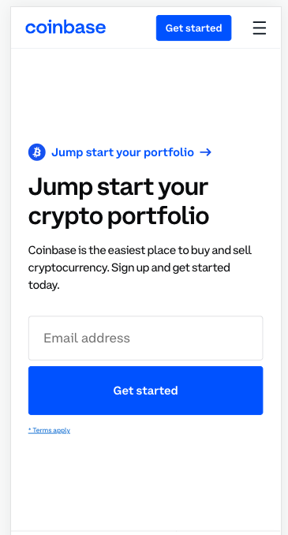
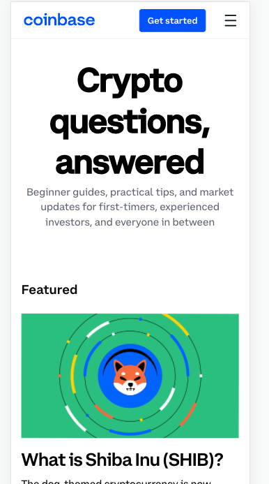
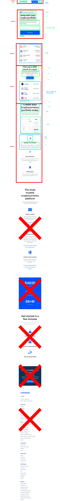
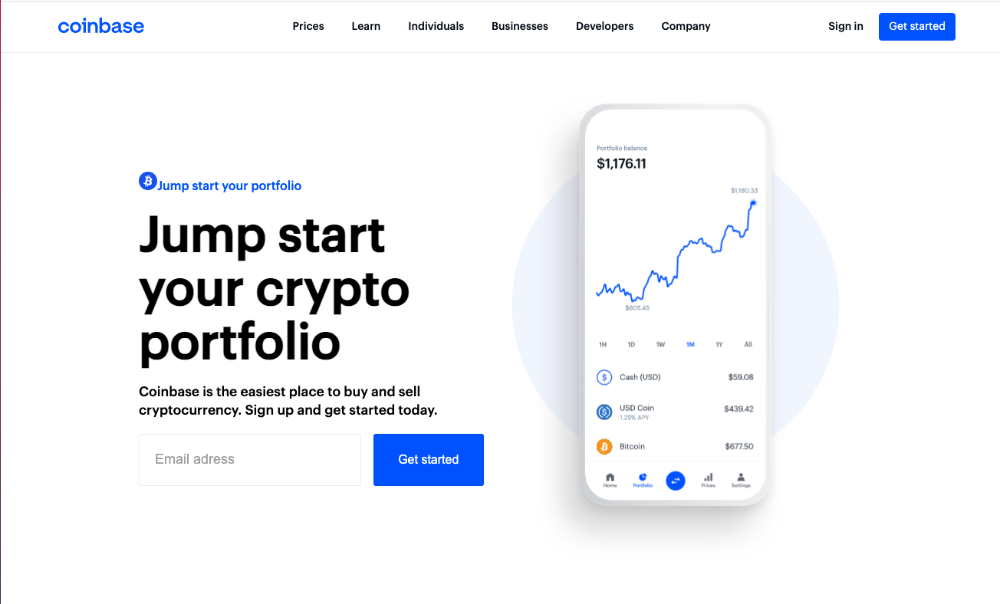
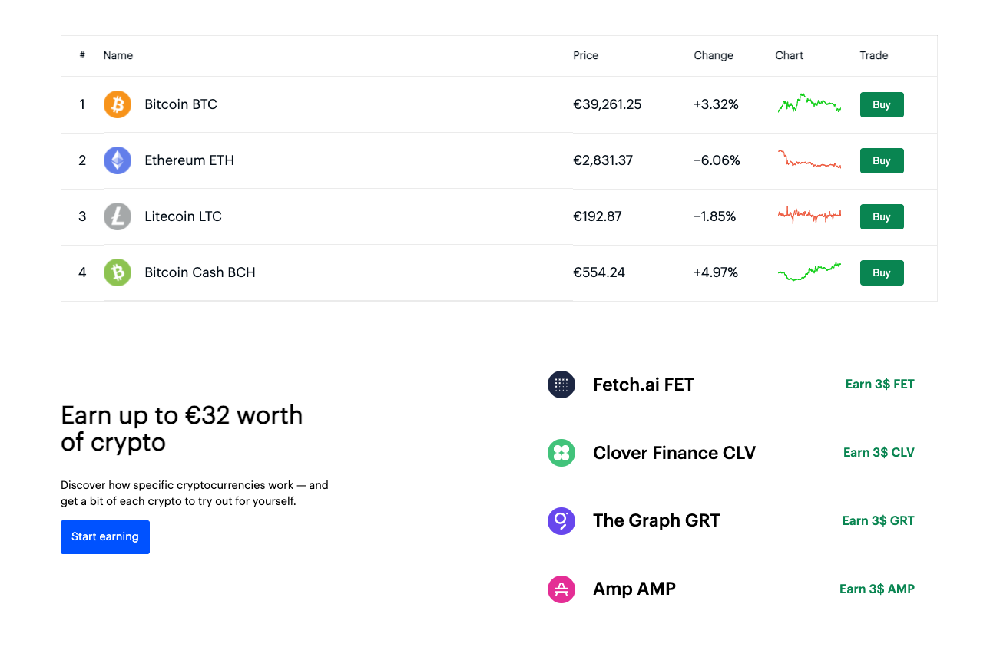
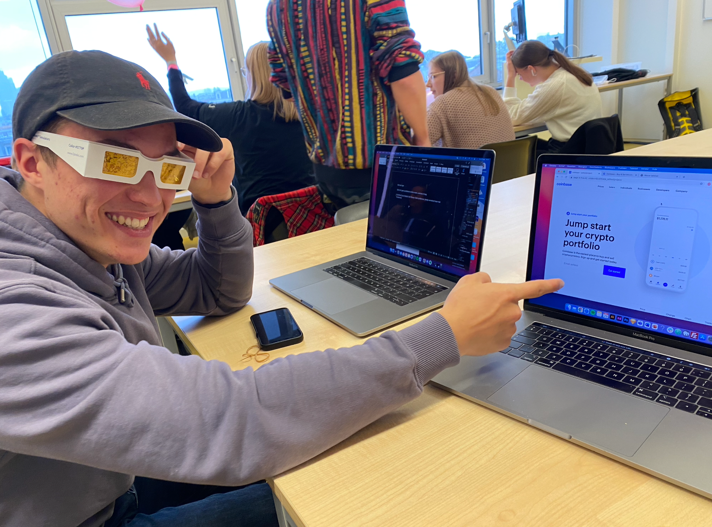

# Procesverslag
Markdown is een simpele manier om HTML te schrijven.  
Markdown cheat cheet: [Hulp bij het schrijven van Markdown](https://github.com/adam-p/markdown-here/wiki/Markdown-Cheatsheet).

Nb. De standaardstructuur en de spartaanse opmaak van de README.md zijn helemaal prima. Het gaat om de inhoud van je procesverslag. Besteedt de tijd voor pracht en praal aan je website.

Nb. Door *open* toe te voegen aan een *details* element kun je deze standaard open zetten. Fijn om dat steeds voor de relevante stuk(ken) te doen.

## Jij

uitwerken voor kick-off werkgroep

### Auteur:
Reinier van der Velden

#### Je startniveau:
Rode piste

#### Je focus:
responsive

## Je website

uitwerken voor kick-off werkgroep

### Je opdracht:
Ik ga coinbase proberen na te maken:
https://www.coinbase.com/

#### Screenshot(s) van de eerste pagina (small screen):
hier de naam van de pagina  

#### Screenshot(s) van de tweede pagina (small screen):
hier de naam van de pagina  

## Breakdownschets (week 1)

uitwerken na afloop 2e werkgroep

### de hele pagina:

## Voortgang 1 (week 2)

uitwerken voor 1e voortgang

### Stand van zaken
Het gaat opzich best goed, Ik ben bezig de home pagina ben al wel over de helft. Ik maak alles meteen responsive omdat ik denk dat dit makkelijker is.

### Verslag van meeting
hier na afloop snel de uitkomsten van de meeting vastleggen

- We hadden met ze alle besproken waar iedereen vast liep, Zelf had ik moeite met een hover effect de assistenten hebben mij hier goed mee geholpen om dit alsnof voor elkaar te krijgen.
Verder ging bij mij alles wel goed. ik ga proberen de eerste pagina komende week af te maken.

## Voortgang 2 (week 3)

uitwerken voor 2e voortgang

### Stand van zaken
Het gaat opzich wel goed ik heb nu bijna de homepage af met de content die ik erop wil hebben. Er zijn alleen nog een paar dingen die ik moet fixen voor het responsive gedeelte.

Om live te zien waar ik momenteel mee bezig ben is hier de link van mijn website. Ik zorg ervoor dat ik deze regelmatig update.
https://oege.ie.hva.nl/~veldenr4/coinbase_schoolproject/

### Verslag van meeting
hier na afloop snel de uitkomsten van de meeting vastleggen

- Ik had zelf niet echt punten die ik moest bespreken ik vond het wel fijn om mijn werk te laten zien zodat ik toch op die manier weet of ik de goeie richting op ging

## Toegankelijkheidstest (week 4)

uitwerken na test in 8e voortgang

### Bevindingen
Ondanks dat voor ons het testen leuk was om te doen zit er natuurlijk ook een serieuze kant aan aangezien er mensen zijn die daadwerkelijk zulke beperkingen hebben.
Dit zijn mijn bevinden die ik heb ondervonden/ ervaren

Er waren speciale brillen die je kon opdoen en verschillende soorten "effecten" kreeg, ik had niet alle brillen uitgetest maar wel een paar.
- bril met gele glazen
- Suikerziekte brillen
- bril met een stip in het midden

Ik had ook gebruik gemaakt van de balon hooghouden om op die manier iemand met een lage concentratie te ervaren.

Tot slot had ik het schokband om. Dit was een hele ervaring  

#### Verschillende brillen bevindingen.
- bril met gele glazen:
Deze bril was naar mijn mening het minst erg omdat je eigenlijk nog alles kon zien alleen vielen sommige kleuren weg. En op plekken waar geen goed contrast was moeilijk te lezen/zien.

De oplossing is denk ik erg simpel door te zorgen dat je goed contrast hebt.

- suikerziekte brillen:
Het nadeel van deze bril was dat je letterlijk sommige delen van je website niet meer kon zien. Ik hoop voor mensen met suikerziekte dat ze altijd optijd zijn met insuline inspuiten want dat zicht was niet prettig en hoop je dat niemand krijgt als het voorkomen kan worden.

- bril met stip in het midden:
Deze bril was moeilijk want je kon niet echt het midden punt zien van de website. Ook in mijn geval bij coinbase soms het menu niet.

Ik denk dat de oplossing hiervoor kan zijn is na te denken over een design waarbij bijv het menu aan de zeikant zit.

#### Balon hooghouden.
op mijn eigen site was het nog niet te moeite om dit te gaan testen wel ben ik gaan testen om bijvoorbeeld een berichtje te typen terwijl je de balon moet hooghouden dit was nog al een opgave... bijzonder om te zien dat je denkt het lukt makkelijk maar dat dat toch wel moeilijk blijkt te zijn

#### schokband.
Dit was een hele vreemde ervaring om geen controlle meer te hebben over je spieren.
Ik probeerde te scrollen op me site maar zelfs dat lukte me eigenlijk niet omdat ik bijna niet de touchpad normaal kon aanraken. Ik denk dat hiervoor de beste oplossing is als je zorgt dat je kan scrollen met de pijltjes toetsten of misschien wel voice controll aanzetten op de laptop / mobiel

## Voortgang 3 (week 4)

uitwerken voor 3e voortgang

### Stand van zaken
hier dit ging goed & dit was lastig (neem ook screenshots op van delen van je website en code)

### Agenda voor meeting
samen met je groepje opstellen

| student 1      | student 2          | student 3    | student 4        |
| ---            | ---                | ---          | ---              |
| dit bespreken  | en dit             | en ik dit    | en dan ik dat    |
| en dat ook nog | dit als er tijd is | nog een punt | dit wil ik zeker |
| ...            | ...                | ...          | ...              |

### Verslag van meeting
hier na afloop snel de uitkomsten van de meeting vastleggen

- punt 1
- punt 2
- nog een punt
- ...

## Eindgesprek (week 5)

uitwerken voor eindgesprek

### Stand van zaken
hier dit ging goed & dit was lastig (neem ook screenshots op van delen van je website en code)

### Screenshot(s)

hier screenshot(s) van je eindresultaat

## Bronnenlijst

continu bijhouden terwijl je werkt

1. w3 schools - IK heb hier gekeken voor kleine dingen
2. stack overflow. combine hover with after https://stackoverflow.com/questions/13233991/combine-after-with-hover
3. css - tricks grid. https://css-tricks.com/snippets/css/complete-guide-grid/

